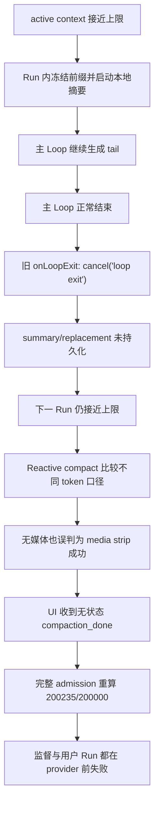
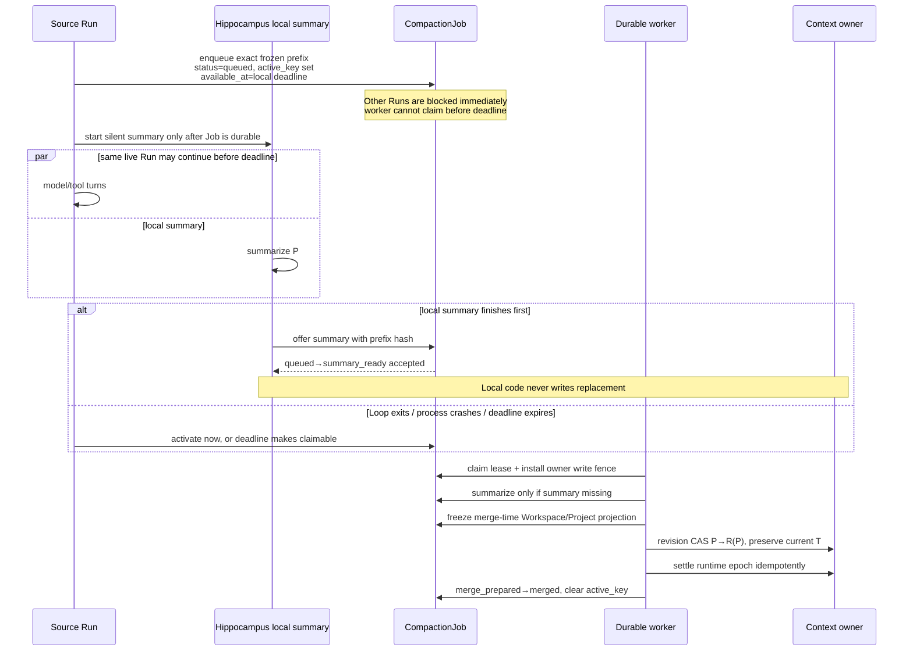
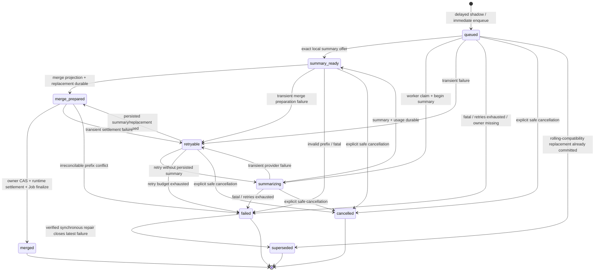

# Pegasus / Sci-Pegasus 持久化上下文压缩事故复盘与迁移设计

> 文档类型：事故复盘、最终实现说明、Pegasus 迁移规范与运维手册  
> 主要读者：需要在 Pegasus 本体复刻修复的 Runtime、后端、前端和 SRE 工程师  
> 事故现场：2026-08-10（Asia/Tokyo）  
> 实现对齐：Sci-Pegasus 2026-08-10 当前工作区；尚未形成可引用的发布 commit  
> 生产状态：**代码、production build、非 Mongo 与隔离 Mongo fault suite 均已验证；尚未部署到 production；“血糖”项目尚未执行 repair**

## 0. 执行摘要

Sci-Pegasus 的“血糖”研究项目在接近模型上下文上限时进入不可继续状态。系统的第二次异步 Hippocampus 压缩已经启动，但 Root 主 Loop 正常结束时，旧实现执行了 `cancel('loop exit')`。冻结前缀没有被摘要替换，随后 Reactive compact 又因为比较了不同口径的 token 数而产生“无媒体也算媒体剥离成功”的假成功。UI 将 `cancelled / failed / merged` 都显示成了“上下文压缩完成”；下一次完整 admission 仍得到 `200,235 >= 200,000`，监督 Run 和用户续写均在模型调用前失败。

根因继承自 Pegasus，而不是 Sci-Pegasus 多 Agent 改造新引入。原始取消逻辑可追溯至 Pegasus 提交：

- commit：`a90d775e859c3cbd96ed5224a268607c8f6a3be2`
- subject：`agent: 接入 Hippocampus 异步上下文压缩`
- author date：2026-07-19 16:41:20 +09:00
- 原始路径：`lib/agent/hippocampus-runtime.ts`
- 原始语义：Loop 退出且后台摘要仍在运行时执行 `cancel('loop exit')`

正式修复不是“让 Promise 多活几秒”，而是改变维护任务的所有权：

```text
错误：AgentRun owns a detached background Promise
正确：ContextOwner owns a durable CompactionJob
      worker owns a fenced attempt
      AgentRun only records who triggered the job
```

Sci-Pegasus 当前工作区已经接通最终链路：

1. 本地摘要调用前先写入带未来 `available_at` 的 delayed shadow Job，并立即安装 `active_key`。
2. 同一存活 executor 只可在 deadline 前绕过自己创建且仍为 `queued` 的精确 shadow；其他 Run 一律被 admission barrier 延迟。
3. source Run 的主模型 turn 持有可续租 `source_turn_guard`，worker claim 的单文档 CAS 会拒绝未过期 guard；进程崩溃后 guard 过期才允许 takeover。
4. 同一进程内的主模型 turn 与 local summary offer 经过 FIFO gate 串行：主 turn 先赢时，offer 等到 assistant/tool-use checkpoint durable；offer 先赢时，主 turn 不调用 provider，而是 defer 后重载。若 guard 在慢持久化期间到期，但 model checkpoint 已经 durable，则该 action 视为已提交 tail，绝不重放；普通 tool-use 先补齐唯一的 durable result，再在协议完整边界重载。
5. 本地摘要先完成时，只把 summary offer 给 Job；replacement 和 owner 写入仍由 durable worker 独占。
6. Loop 先结束、进程崩溃或本地 deadline 到达时，Job 被激活或在 deadline 后自动可 claim；维护工作不随 Run 结束。
7. worker 使用 lease fence，冻结 merge-time Workspace/Project Context 投影，通过 owner revision CAS 写入 `R(P) + T`。
8. owner swap、runtime settlement、Job terminal finalize 分阶段幂等恢复。
9. Root 和成员主要消息追加路径将完整 transcript 与 active compacted context 在同一 owner 文档更新中原子推进。
10. 状态变化使用 Job 内 transactional outbox；UI 读取真实 `compaction_status`，容量来自冻结的服务端模型 resolution snapshot。

本文中的“已实现”仅指当前 Sci-Pegasus 工作区及隔离测试数据库。它**不表示 production 已部署，也不表示事故项目已经恢复**。

---

## 1. 范围、非目标与当前结论

### 1.1 本文解决

- 主 Loop 正常结束错误取消后台压缩。
- 摘要、replacement、owner swap 与 runtime settlement 没有 durable 生命周期。
- 不同 Run 可以在压缩临界期继续调用模型。
- 失租 executor 可能迟到写入。
- `messages` 与 `compacted_messages` 分两次追加造成一侧 tail 丢失窗口。
- Reactive compact 使用不一致 token 估算而产生假成功。
- UI 将不同终态抹平成一个 `compaction_done`。
- 单机 Mongo、进程重启、owner 删除和部分提交下的恢复语义不完整。
- 为 Pegasus 提供不依赖 Sci AgentTeam 的移植边界。

### 1.2 本文不解决

- 不删除完整 transcript、Workspace、证据账本或用户输入来节省上下文。
- 不改变科研策略、提示词和文献证据规则。
- 不把 Compaction 暴露成模型工具。
- 不要求 Mongo replica set 或跨文档事务。
- 不要求 Pegasus 引入 Sci-Pegasus 的 AgentTeam、AgentSession、Team SSE 或成员 Workspace ACL。
- 不承诺外部 LLM 调用 exactly-once；provider 不支持请求幂等时，崩溃窗口仍可能产生重复费用。

### 1.3 当前状态矩阵

| 项目 | 当前事实 |
|---|---|
| Sci-Pegasus 代码 | delayed shadow、source-turn guard、summary offer、worker、barrier、CAS、runtime settlement、状态 outbox、UI/容量、operator repair 已接线 |
| Worker 注册 | 已在 `instrumentation-node.ts` 注册并在 graceful shutdown 时停止 |
| Root / member | Root Conversation 与 member AgentSession 均接入同一 durable core |
| Production build | 最新审计已通过 |
| 纯 TypeScript / 非 Mongo 测试 | 最新审计已通过，命令见 §16 |
| 最新扩展 Mongo fault suite | `npm run agent-compaction:verify:mongo` exit 0；六组隔离 `*_test` fixture 全部通过，详见 §16.2 |
| Production 部署 | **未部署** |
| “血糖”项目 repair | **未执行** |
| Pegasus 本体 | 本文只提供迁移规范；未由本次工作修改 |

---

## 2. 事故现场与证据

### 2.1 受影响项目

| 项目 | 现场值 |
|---|---|
| Conversation | `945a146d-c34c-4d6d-9839-323ddd8fc37a` |
| 项目代称 | “血糖”研究项目 |
| 团队规模 | 8 个 Agent |
| 审计历史 | 298 条消息，约 983K JSON 字符 |
| Root 活动上下文 | 222 条 `compacted_messages`，约 616K JSON 字符 |
| 现场 Root Run | 无活动 Run |
| 可继续的第二次 durable checkpoint | 无 |
| 数据完整性 | transcript 与 Workspace 产物未丢失 |

字符数不是 token 数，只用于说明上下文增长规模，不应作为阈值硬编码。

### 2.2 时间线

| 时间（JST） | 观察结果 | 结论 |
|---|---|---|
| 17:14–17:16 | 第一次异步压缩执行 | 旧链路并非完全不可用 |
| 17:16:02 | 77 条旧消息被 1 条 replacement 替换 | 第一次真实 merge 成功 |
| 同次请求前后 | 模型输入 `135,986 → 51,587` | replacement 对 active context 生效 |
| 17:34:13 | 第二次后台压缩启动 | 已达到触发条件并冻结前缀 |
| 17:34:53 | 因 `loop exit` 取消 | summary 未进入 replacement merge |
| 17:38 左右 | Reactive compact 报告媒体剥离成功 | 实际无媒体、消息未缩短 |
| 17:38:25 | 自动监督失败 | `200,235 input tokens >= 200,000 window` |
| 17:38:35 | 用户续写失败 | 同一 admission 错误稳定复现 |

第一次真实 compaction API 大约耗时 48.5 秒；第二次启动约 40 秒后被取消。它“可能接近完成”只是说明取消发生在合理的 provider 调用窗口内，不证明再运行固定时间必然成功。

### 2.3 快速回填

第一次 merge 后 active context 又追加了 221 条消息。已观察的大结果包括：

| 来源 | 约字符数 |
|---|---:|
| `ReviewWorkspaceChanges` | 158,453 |
| `Read` | 77,652 |
| `Write` 输入 | 38,217 |
| `TaskList` | 18,170 |

因此事故不是第一次压缩无效，而是长任务快速回填后，第二次应接棒的压缩被 Run 生命周期中断。

### 2.4 UI 为什么显示 `185K / 186K`

- UI 快照早于最终失败请求。
- 旧 UI 展示口径扣除了约 14K 固定开销，而 provider admission 使用完整请求口径。
- admission 在 provider 返回 usage 前失败，因此没有新的 `token_usage` SSE 修正旧值。
- 旧代码又把取消/失败广播成无状态 `compaction_done`，造成“已经压缩但仍超限”的错觉。

---

## 3. 继承来源与完整因果

### 3.1 Pegasus 原始缺陷

原始 `HippocampusRuntime.onLoopExit` 的核心行为可概括为：

```ts
if (background.phase === 'succeeded') mergeNow(messages)
else if (background.phase === 'running') background.cancel('loop exit')
```

这把“本轮用户任务结束”错误等价为“服务于下一轮的 owner 维护工作也不再需要”。压缩结果属于 Conversation / AgentSession，而不是触发它的临时 Run。

现场审计时，Pegasus 与 Sci-Pegasus 的 `lib/agent/hippocampus-runtime.ts` SHA-1 都是：

```text
5699c892bd73fa589e914084cfc22ad6f647c0f9
```

多 Agent、短监督 Run、批量全文和 Workspace 审批提高了触发概率，但不是根因。

### 3.2 Reactive compact 的假成功

旧实现比较：

```text
before = API correction + system/tools/project overhead + messages
after  = local messages-only estimate
```

现场约为：

```text
before = 200,235
after  = 147,097
```

即使 `stripAllMedia` 没移除任何图片，也会表面满足 20% 降幅。最终代码改为：

- before/after 使用同一个 request-input estimator；
- API/local correction 对所有 candidate 一致传播；
- 必须证明 `removedMedia > 0` 且 token 真下降；
- candidate 必须低于 `contextWindow - maxOutputTokens`；
- 否则进入 full compact，且 full compact 仍需通过同口径的 reduction 与 headroom 断言。

### 3.3 完整因果图



---

## 4. 必须保持的系统不变量

### 4.1 Transcript 与 active context 分离

- `messages` 是完整用户历史与审计事实，压缩不删除、不重排。
- `compacted_messages` 是下一次模型实际使用的 active context；非空时优先。
- Workspace 与证据文件是长期事实源，replacement 只保存路径和摘要，不复制全文。
- `compaction_count` 只在 owner replacement CAS 成功时增加一次。

### 4.2 原子前缀替换、tail 原样保留

设 Job 冻结前缀为 `P`，之后追加为 `T`，summary replacement 为 `R(P)`：

```text
触发时：P
处理中：P + T
合并后：R(P) + T
```

必须用冻结长度、boundary ID 和 canonical hash 确认 `P`。不得只按陈旧数组下标覆盖整个 active context，也不得重摘要或丢弃 `T`。

### 4.3 一个 owner 只有一个 active Job

- Root owner：`conversation:{conversation_id}`。
- Sci member owner：`agent_session:{session_id}`。
- `active_key` 只存在于活动 Job，并通过 partial unique index 保证单 owner 唯一。
- 多个并发触发通过 `idempotency_keys` 加入同一个 Job，而不是创建多个摘要。

### 4.4 Lease 与写入真实性

- source Run 的主模型 turn 使用独立 `source_turn_guard(token/owner/source_run/heartbeat/expiry)`；它不是 worker lease，也不占 Agent execution slot。
- acquire 只接受 exact owner、primary idempotency key、source Run、`queued + active + unleased` delayed shadow；joined trigger key 不能取得该权限。
- worker claim 与 guard acquire 使用同一 Job 文档上的竞争 CAS：未过期 guard 拒绝 claim；guard 过期后 takeover 会原子清除它。
- heartbeat 不能复活过期 guard；旧 token 不能释放替代 guard。offer、activate 与 terminal transition 也不能越过 live guard。
- 只有当前 Job lease 的 `owner_id + fence_token + expires_at` 可以推进 worker 状态。
- owner swap 还必须匹配 owner 上的 `context_compaction_fence`。
- 失租 provider 响应即使迟到，也不能写 summary、replacement、usage 或 owner。
- 只有 owner 已写入 `last_applied_compaction_id = job_id` 且 runtime 已 settlement，Job 才可 `merged`。

### 4.5 模型与证据安全

- compaction provider 强制 `tools: []`，不捕获原 Run 的 Workspace closure。
- Job 同时持久化 registry alias 与无密钥 `model_resolution_snapshot`：真实模型 ID、key channel、vision、W/O/R/TTL、registry revision/hash。API key 始终只在执行时按冻结 channel 从环境读取。
- 公共 status 查询不选择 summary、frozen messages、provider request/response 或密钥字段；`last_error` 是当前唯一的诊断例外，processor 会截断并替换已知 API key。它不是完整的内容脱敏器，Pegasus 最好进一步映射为稳定错误码与安全文案。
- 未识别 Job 状态 fail closed，不能当作“没有 barrier”。

---

## 5. 最终架构与正常生命周期

### 5.1 ContextOwner

```ts
type CompactionContextOwner =
  | {
      kind: 'conversation'
      conversationId: string
      userId: string
    }
  | {
      kind: 'agent_session'
      sessionId: string
      conversationId: string
      userId: string
      teamId?: string
      agentId?: string
    }
```

Pegasus 只需实现 `conversation`。Sci-Pegasus 的两类 owner 共用 Job、repository、worker、hash 和状态机。

### 5.2 Delayed shadow → summary offer → durable worker



关键语义：

1. `onStart` **await** delayed shadow 写入，silent provider 调用不能先于 durable intent。
2. `active_key` 立即安装，即使 `available_at` 在未来；它是其他 Run 的 admission barrier。
3. worker 在 deadline 前不能 claim；当前 live executor 才能继续本地摘要。
4. self-shadow bypass 只允许“同一进程、同一 Job、仍为 `queued`、仍早于 deadline”；真正调用主模型前还必须取得 durable source-turn guard。
5. 主 turn 与 local summary offer 通过 FIFO gate 排序。主 turn 持 guard 直到 assistant/tool-use 已 `flushIncremental + model action complete`；工具执行本身不持有 guard。
6. 一旦 Job 变为 `summary_ready`、被 claim或 deadline 到达，self bypass 失效。provider 前或 append 前 guard 丢失时，source Run 必须 durable defer；若 `flushIncremental + model action complete` 已成功，则该 action 已是唯一 durable tail：text/control 正常终结，普通 tool-use 补齐唯一 result 后再重载。
7. local summary offer 只接受 exact prefix、unclaimed `queued` Job，并与 guard/worker claim 使用单文档 CAS。接受后 local path 返回 `handed_off`，禁止本地 merge。
8. worker 已 claim 时，local offer 返回 `durable_owned`；local 结果被丢弃，避免双写。
9. Loop 结束时先释放 source-turn guard，再激活 Job；确认 durable ownership 后才取消本地 task。
10. 没有 durable callbacks 的兼容路径会 drain 已开始的本地摘要到原子替换，不再因正常 Loop 退出取消。
11. shadow 准备失败、身份不匹配，或 guard 在 provider/append 权限确认阶段失守时 fail closed，不继续 silent/main provider；checkpoint 已提交后的 release 失守遵循第 6 条，绝不重放已完成 action。

### 5.3 Worker

`startDurableCompactionWorker` 是有限并发 maintenance worker：

- 默认并发 2，硬上限 8；
- 默认每 2 秒 poll；
- 默认 90 秒 lease，20 秒 heartbeat；
- 每个进程都可启动，Mongo lease 选出单 executor；
- expired lease 可 takeover；
- 空队列严格等待 poll interval，真实 claim 才立即补满空闲并发槽；显式 `wake()` 可抢占长轮询 timer；
- shutdown abort 外部请求，并等待正在执行的任务以及仍阻塞在 Mongo claim 的 pump；停机后才返回的 claim 会先释放 lease 回 retryable，绝不在 `stop()` 返回后启动 processor；
- 不占 AgentTeam 的成员执行槽；
- worker loop 同时清理过期 owner-write fence，并 flush status outbox。

Sci-Pegasus 已在 `instrumentation-node.ts` 的可重试 Mongo startup sweep 中注册 worker，并在 SIGTERM/SIGINT graceful shutdown 中调用 `stop()`。

---

## 6. 正式状态机

### 6.1 状态集合

```ts
type DurableCompactionStatus =
  | 'queued'
  | 'summarizing'
  | 'summary_ready'
  | 'merge_prepared'
  | 'retryable'
  | 'merged'
  | 'failed'
  | 'cancelled'
  | 'superseded'
```

### 6.2 状态图



实际 claim 会先在 Job 上安装 lease 并增加 `attempt`，状态可能短暂仍是 `queued`；随后 `beginCompactionSummary` 才进入 `summarizing`。不要把“有 lease”等价为某个 UI 状态。

### 6.3 状态语义

| 状态 | 持久事实 | Admission |
|---|---|---|
| `queued` | exact frozen intent 已持久化；可能是 delayed shadow | block；仅 exact live self-shadow 可临时绕过 |
| `summarizing` | worker 正在生成 summary | block |
| `summary_ready` | summary/usage 已持久化 | block；self-shadow 不再可绕过 |
| `merge_prepared` | merge-time projection 和 deterministic replacement 已持久化 | block |
| `retryable` | 错误与下一次 `available_at` 已持久化 | block |
| `merged` | owner 与 runtime 均已收敛 | open |
| `failed` | durable 尝试终止，输入仍在 | open only with explicit `repairRequired` contract |
| `cancelled` | 安全阶段显式取消 | open |
| `superseded` | 另一个已验证的 owner replacement 接管 | open |

`summary_ready` 和 `merge_prepared` 都不是完成。只有 `merged` 可以向用户声称“上下文压缩完成”。

### 6.4 `superseded` 的两个合法来源

1. **滚动升级兼容路径已经先提交了可验证 replacement。** 只能终止 `queued + no lease` shadow；不能抢走已 claim 或 `merge_prepared` 的 durable Job。正式 durable 路径不会再由内存中的 local merge 直接写 owner：local silent summary 只 offer 到同一个 Job，最终 replacement 一律由 durable worker 提交。这个来源只为旧进程/旧 checkpoint 的兼容收敛保留。
2. **最新 `failed` Job 被同步修复。** owner 已经由正常同步 compact 写入新的 canonical head，修复命令验证后把旧失败 Job 标为 `superseded`，原因 `sync_repair`。

`superseded` 是保留审计记录的终态，不是删除 Job。

---

## 7. 数据模型与索引

### 7.1 `context_compaction_jobs`

当前 Sci-Pegasus collection 为 `context_compaction_jobs`。核心字段：

```ts
interface DurableCompactionJobRecord {
  job_id: string
  owner_key: string
  owner_kind: 'conversation' | 'agent_session'
  conversation_id: string
  user_id: string
  agent_session_id?: string | null
  team_id?: string | null
  agent_id?: string | null
  source_run_id?: string | null

  idempotency_key: string
  idempotency_keys: string[]
  model_alias_snapshot?: string | null
  model_resolution_snapshot?: {
    snapshot_version: 1
    alias: string
    real_model: string
    key_channel: 'orchestrator' | 'tools'
    supports_vision: boolean
    context_window: number
    max_output_tokens: number
    compaction_max_output_tokens: number
    prompt_cache_ttl: '5m' | '1h' | 'none'
    registry_revision: string
    registry_hash: string
    resolved_at: Date
  } | null

  status: DurableCompactionStatus
  status_revision: number
  status_outbox: DurableCompactionStatusOutboxEntry[]
  active_key?: string

  frozen_prefix: {
    context_revision: number
    prefix_length: number
    prefix_hash: string
    boundary_message_id?: string
    messages: ConversationMessage[]
  }

  project_context_snapshot?: FrozenProjectContextSnapshot | null
  workspace_projection?: FrozenWorkspaceProjection | null
  merge_project_context_snapshot?: FrozenProjectContextSnapshot | null
  merge_workspace_projection?: FrozenWorkspaceProjection | null
  merge_projection_prepared_at?: Date | null

  summary?: string | null
  summary_usage?: TokenUsage | null
  replacement_message?: ConversationMessage | null
  replacement_hash?: string | null
  merge_context_revision?: number | null
  merged_context_revision?: number | null
  runtime_settled_at?: Date | null

  attempt: number
  lease?: {
    owner_id: string
    fence_token: string
    heartbeat_at: Date
    expires_at: Date
  } | null
  available_at?: Date | null
  last_error?: string | null
  created_at: Date
  updated_at: Date
  finished_at?: Date | null
}
```

Job 保存精确 frozen prefix，保证进程重启后不依赖 Run closure，并兼容没有稳定 message ID 的旧消息。它**不复制持续增长的 live tail**；tail 仍只存在 owner active context 中。

### 7.2 索引

```text
unique(job_id)
unique(owner_key, idempotency_key)
unique(owner_key, idempotency_keys)
unique(active_key) partialFilter { active_key: { $type: 'string' } }
index(status, available_at, lease.expires_at, created_at)
```

当前设计没有 `active: true` 字段。活动唯一性完全由 `active_key` 表示：活动 Job 保存 `active_key = owner_key`，任何终态都 `$unset active_key`。

### 7.3 Owner 字段

Conversation 和 AgentSession owner 都包含：

```ts
interface OwnerCompactionFields {
  context_revision: number
  last_applied_compaction_id?: string | null
  context_compaction_fence?: {
    job_id: string
    fence_token: string
    expires_at: Date
  } | null
}
```

- `context_revision` 只为 active model context 的变化推进。
- `last_applied_compaction_id` 是 owner CAS 已成功的事实标记。
- `context_compaction_fence` 只是 worker owner-write fence；它不是用户/Run admission barrier。

---

## 8. Admission barrier、source-turn guard 与 owner-write fence

这两个概念必须在 Pegasus 迁移中保持分离。

### 8.1 Admission barrier

来源：Job 的 `active_key + status`。

活动状态：

```text
queued, summarizing, summary_ready, merge_prepared, retryable
```

检查点：

1. Runner claim Run 后、获取 Team/session 执行槽之前；
2. 获取执行 lease 后、HTTP dispatch 之前再次检查；
3. executor 进入 AgentLoop 前检查；
4. 每次 `model_request` action 之前检查，关闭后续 turn 的竞态。

若活动 Job 存在：

- Run 保持同一 ID 和输入身份；
- 持久化为可重试队列状态，设置短 `available_at`；
- 释放 Run/Team/session lease；
- 不复制 request envelope，不忙等，不调用 provider；
- Runner 后续自动重试，直到 Job terminal 后从 owner 重载 context。

unknown 状态 fail closed。`failed` 是特殊终态：barrier 返回 open，但携带 `repairRequired + terminalJobId + idempotencyKey`。后续 Run 可以进入正常 admission；它不能把旧失败误记为成功，只有新的同步 replacement 已实际提交时才能用受控 repair 命令收尾。

### 8.2 Exact self-shadow bypass

本地 Run 创建 delayed shadow 后会保存进程内：

```ts
{ jobId, before: initialAvailableAt }
```

只有满足全部条件才能临时继续：

- barrier decision 是 `defer`；
- Job 仍为 `queued`；
- Job ID 与进程内 marker 精确一致；
- 当前时间早于 deadline。

恢复 Run 没有 marker，不能绕过。Job 已变为 `summary_ready` 即使仍早于 deadline，也不能绕过。marker 只允许进入 source-turn guard 的竞争，不是 provider 执行权本身。

### 8.3 Source-turn guard

来源：当前 source Run 的精确 delayed shadow。Job 持久化：

```text
{ token, owner_id, source_run_id, heartbeat_at, expires_at }
```

它解决“barrier 已读到 queued，但 local summary 随后 offer、worker 同时 swap”的 TOCTOU：

- main-model phase 和 local offer 先经过同一个进程内 FIFO gate；
- main phase 在 provider 前通过 Mongo CAS acquire，长调用期间 heartbeat；
- guard 保持到 assistant/tool-use checkpoint 与 model action journal 都 durable；
- offer 先取得 gate 时，main phase acquire 失败并 durable defer，provider call 数为 0；
- main phase 先取得 gate 时，offer 等到 checkpoint 与 exact release 后才进入 `summary_ready`；
- provider error、413、用户中断、flush error 与 outer throw 都走 once-safe release；原始错误优先于 cleanup error；
- 在 append 前的最后一次 heartbeat 失败时，provider response 不得落库并立即 defer；若 heartbeat 当时成功、worker 只在慢 append 期间 takeover，则 `flushIncremental + onActionComplete` 成功后该 model action 已成为唯一 durable tail，release 失败不能重排它。终态 text/control 正常结束；普通 tool-use 只执行一次并持久化配对 result，随后在下一 model request 前 reload；
- 进程硬崩后 guard 到期，worker claim 才能 takeover；stale token 无法 heartbeat、release 或 ABA 覆盖新 guard。

### 8.4 Owner-write fence

来源：worker Job lease。worker claim 后将：

```text
{ job_id, fence_token, expires_at }
```

写到 owner 的 `context_compaction_fence`。它只用于：

- 防止过期/失租 worker 执行 owner swap；
- 让 heartbeat 同步延长 Job lease 与 owner fence；
- takeover 时替换过期 fence；
- owner CAS 成功或 terminal/retry 时清理。

正常消息 append 不由这个 fence 阻塞；append 继续推进 `context_revision`，worker CAS 重读并保留新的 tail。

---

## 9. Merge-time projection、CAS 与 runtime settlement

### 9.1 为什么不是 trigger-time Workspace

从摘要触发到实际 owner swap 之间，Agent 可能继续写 Workspace。若 replacement 使用 trigger-time projection，压缩会把模型看到的文件视图回滚到旧 epoch。

worker 在 summary 已 durable、replacement 尚未构造时调用 `prepareDurableMergeContext`：

1. 以 owner 身份列出 canonical Workspace 文件元数据；
2. 读取当前 runtime Project Context；
3. 在 trigger snapshot 与 runtime snapshot 中选择 epoch 较新者；
4. 将 epoch 增加一次并嵌入 merge-time Workspace projection；
5. 持久化 `merge_*` 字段和 `merge_projection_prepared_at`；
6. 后续 crash retry 复用这些字段，**不重新 list 一个更晚的 Workspace**。

因此 replacement 是一个可重放的 prompt epoch，而不是每次 retry 都变化的 live view。

### 9.2 Deterministic replacement

- message ID 由 `job_id` 哈希确定；
- timestamp 使用 Job `created_at`；
- summary、merge projection、Project Context 均来自持久字段；
- `replacement_hash` 验证 replay 构造完全一致。

### 9.3 两阶段 owner CAS 与第三阶段 runtime settlement

当前单机 Mongo 协议实际有三个持久边界：

#### A. Owner swap

worker 读取 owner：

- owner 未删除；
- `last_applied_compaction_id` 尚不是当前 Job；
- live active context 至少包含 frozen prefix；
- live prefix hash 与 Job 相同；
- owner `context_revision` 和 `context_compaction_fence` 匹配。

构造：

```text
next = deterministic replacement + live tail after frozen_prefix.length
```

同一 owner document CAS 写入：

- `compacted_messages = next`；
- `context_revision += 1`；
- `last_applied_compaction_id = job_id`；
- `context_compaction_fence = null`；
- Conversation 的 `compaction_count += 1`。

revision 冲突时最多重读 8 次，每次重新保留最新 tail；不重新摘要。

#### B. Runtime settlement

owner swap 后，worker 幂等：

- 清理旧 `hippocampus.active_compaction`；
- 设置 `last_settled_compaction_id`；
- 重置 `turns_since_merge / rapid_refills / breaker`；
- 推进 telemetry snapshot version；
- 更新 Project Context，但绝不覆盖 epoch 更高的后续 runtime；
- 写 `runtime_settled_at`。

#### C. Job finalize

只有 owner 的 `last_applied_compaction_id` 和 `runtime_settled_at` 都可证明时，才：

- `merge_prepared → merged`；
- 写 `merged_context_revision / finished_at`；
- 清 lease 与 `active_key`；
- 追加 `merged` status outbox。

owner 是 replacement 是否已生效的事实源；Job 是调度和审计源。崩溃在任一边界都由 takeover 收敛，不重复增加 count。

### 9.4 Atomic active-context append

事故后发现另一个独立风险：正常 turn 曾先写 `messages`、再写 `compacted_messages`。进程在两次写之间崩溃会形成一侧 tail。

最终主要路径改为：

- Root：`appendConversationMessages` 使用同一 Conversation aggregation update 同时 reconciliation `messages` 与（若 active）`compacted_messages`；
- member：`appendMemberSessionMessages` 在 session lease 下用同一 AgentSession pipeline update 两个数组；
- 每批消息必须有稳定 `message_id`；
- retry 会先移除同 ID 再按 canonical batch 追加；
- 是否存在 active compacted context 由 Mongo 更新边界中的 owner 文档决定，不信任调用者的陈旧布尔值；
- 同一更新推进 `context_revision`；
- Root 还用 `updated_at + context_revision` CAS 和 14MB projected-size guard，冲突最多重试 8 次。

旧单字段 append/replace API 仍为 legacy recovery/兼容调用存在，但真实 Root/member 增量 checkpoint 已走原子路径。Pegasus 移植时应先完成这项改造，再启用 durable worker。

---

## 10. 崩溃恢复与故障边界

| 崩溃/竞态位置 | 持久事实 | 恢复行为 |
|---|---|---|
| shadow 写入前 | 无 Job；silent provider 尚未开始 | prepare 失败并 fail closed |
| shadow 写入后、本地 provider 前 | `queued + active_key + future available_at` | deadline 后 worker claim |
| 本地 provider 进行中 | delayed shadow 存在 | Loop exit 激活；硬崩溃由 deadline takeover |
| 本地 provider 成功、offer 前 | summary 可能只在进程内 | worker 重新摘要；可能重复费用但不会双写 |
| summary offer 成功后 | `summary_ready` + usage | worker 跳过 provider，直接 prepare merge |
| worker provider 期间 lease 过期 | 新 worker 可 takeover | 旧响应被 lease/fence filter 拒绝 |
| merge projection 持久化后崩溃 | `merge_*` 固定 | retry 复用，不重新 list Workspace |
| replacement 持久化后崩溃 | `merge_prepared` | retry 复用 deterministic replacement |
| owner CAS 前有新 append | owner revision 变化 | 重读 owner，保留新 tail，再 CAS |
| guard 最后 heartbeat 成功、append 期间 worker takeover | response 尚未或已经成为 owner tail | 未提交则 fail closed；`flushIncremental + onActionComplete` 已成功则不重放 model action，text 正常终结，tool-use 补齐唯一 result 后重载 |
| owner CAS 后、runtime settlement 前 | owner `last_applied_compaction_id` 已写 | takeover 幂等 settlement |
| runtime settlement 后、Job finalize 前 | runtime marker + `runtime_settled_at` | takeover 只 finalize Job |
| TeamEvent append 后、outbox ack 前 | Job outbox 未 delivered | dedupe key 重放，不重复事件 |
| owner 被删除 | Job 仍可被 claim | terminal `failed`、清 `active_key`；项目删除路径也批量清 Job |
| worker shutdown，processor 已运行 | in-flight signal aborted | transient retry / expired lease takeover |
| worker shutdown，pump 仍等待 Mongo claim | `stop()` 尚未完成 | 等待 claim 返回；若刚取得 lease，先原子释放为 retryable，不启动 processor，再完成 shutdown |

### 10.1 外部 provider 的 at-least-once 边界

如果 provider 已计费后进程在 summary 持久化前崩溃，而 provider 又不支持请求幂等键，worker retry 可能再次计费。这是外部 I/O 的 at-least-once 边界。内部 replacement、owner swap、runtime settlement、计数和状态事件仍必须幂等；不能把“内部 exactly-once effect”错误扩展成“外部只计费一次”。

### 10.2 Missing owner

- worker 建 fence 前后都检查 owner；
- owner 确认不存在时，即使原 lease 已过期，也只允许持有相同 fence token 的 claim 将 Job terminalize；
- `failed` 写入、lease 清理和 `active_key` 清理同一 Job CAS 完成；
- Conversation 正式删除会调用 `deleteCompactionJobsForConversation` 清理 frozen data。

---

## 11. Failed Job 与同步修复

`failed` 不能简单解释为“barrier 消失，所以安全继续”。它可能意味着 context 仍超限。

最终流程：

1. barrier 查询没有 active Job 后，仍读取该 owner 最新 Job。
2. 最新 Job 为 `failed` 时返回：

   ```text
   open + repairRequired + terminalJobId + terminalIdempotencyKey + terminalError
   ```

3. executor 可进入正常 AgentLoop，但保存这个 repair contract。
4. 若 admission/413 触发同步 full compact，先按正常 owner 写路径提交新 replacement。
5. `closeFailedCompactionAfterSynchronousRepair` 只做验证和状态收尾，**不写 replacement**。
6. 它验证：
   - 该失败 Job 仍是 owner 最新 Job；
   - 没有 active successor；
   - owner `context_revision` 已前进；
   - owner active head `message_id` 等于本次同步 replacement；
   - command identity 与 joined idempotency key 匹配。
7. 验证成功后 `failed → superseded`，reason=`sync_repair`。
8. replay 返回 unchanged，保持幂等。

如果同步 compact 没真正提交 replacement，失败 Job不会被“修复”成 superseded。

---

## 12. Provider、模型、预算与 token

### 12.1 Production durable processor

`createProductionDurableCompactionProcessor()` 每次 attempt 从 Job 重建 summary-only provider：

- 使用持久化 `model_alias_snapshot + model_resolution_snapshot`；
- 真实模型、vision 与 W/O/R/TTL 只读取 Job 冻结快照；执行时仅按冻结 key channel 读取 provider credential；
- 强制 `tools: []`；
- 使用 `FULL_COMPACT_PROMPT` 与冻结快照的 `compactionMaxOutputTokens`；
- 不捕获 Run abort controller、Run callbacks 或可执行 Workspace；
- 成功后解析 summary，并记录 API log / usage；
- 400/401/403/404/413、alias/key 配置错误、预算硬拒绝等分类为 fatal；
- 网络/429/5xx 等进入带指数退避的 `retryable`，默认最多 5 次。

新 Job 在 enqueue 前 await Mongo authoritative registry，并冻结 credential-free resolution；空的首次部署 DB 才使用 JSON seed。旧 alias-only Job 在第一次持有有效 worker lease 时通过 CAS 补齐一次快照，之后 registry 更新或进程 takeover 都不能改写。该设计不持久化 API key。

### 12.2 Sci-Pegasus budget adapter

Sci durable processor 使用现有 `MongoAgentExecutionBudgetLedger`：

- identity 为 Team → Agent → Task（若有）→ detached Run `compaction:{job_id}`；
- provider 调用前 budget reservation；返回后按真实 usage settlement；
- fence 是 CompactionJob lease，而不是已经结束的 source AgentRun lease；
- `teamFenceRequired=false`，不重新占用 Agent execution slot；
- execution-scoped token telemetry 使用 job 对应的 user/conversation/team/agent/task/run 归集。

### 12.3 Pegasus budget adapter

Pegasus 没有 AgentTeam 时，不应移植 `MongoAgentExecutionBudgetLedger` 或伪造 Team：

```ts
interface PegasusCompactionBudgetAdapter {
  reserve(input: {
    conversationId: string
    userId: string
    jobId: string
    modelAlias: string
    leaseOwnerId: string
    fenceToken: string
  }): Promise<Reservation>
  settle(reservation: Reservation, usage: TokenUsage): Promise<void>
  abandon(reservation: Reservation, reason: string): Promise<void>
}
```

它应复用 Pegasus 的 Conversation/Run 预算与 usage ledger，但验证 CompactionJob lease。不要让已关闭 source Run 的 lease 成为 maintenance 调用前提。

### 12.4 Token 口径

所有 before/after/admission 通过同一 request estimator：

```text
messages
+ stable system/tool/skill overhead
+ Project Context overhead（避免重复计算）
+ API/local correction
= projected input
```

主请求限制：

```text
projected input < contextWindow - maxOutputTokens
```

活动 Job 的 UI 容量与 worker 请求都优先来自同一个 `model_resolution_snapshot`；legacy alias-only Job 才回退当前 server registry。主请求 admission 仍使用当前 Run 冻结的服务端模型能力，不再硬编码 200K 或用显示阈值反推 provider 上限。

---

## 13. Status outbox、API、SSE 与 UI

### 13.1 Transactional status outbox

每个 Job 状态迁移通过 `status_revision` CAS，同时在同一 Job update `$push`：

```ts
interface DurableCompactionStatusOutboxEntry {
  transition_id: string
  revision: number
  status: DurableCompactionStatus
  attempt: number
  reason?: string | null
  created_at: Date
  delivered_at?: Date | null
  delivery_attempt?: number
  next_attempt_at?: Date | null
  undeliverable_at?: Date | null
  delivery_error?: string | null
}
```

Job 状态正确性不依赖 event delivery。Sci flusher：

- 将事件投影为 `TeamEvent(type='compaction_status')`；
- dedupe key 为 `compaction_status:{job_id}:{revision}`；
- append 成功后再标记 outbox delivered；
- 失败按 entry 单独指数退避，最大 5 分钟；
- 缺失/已删除 Team 的旧 entry 不会让一个固定批次永久阻塞后面的 live event。

`undeliverable_at` 已在 schema 预留；当前代码对 `team_missing` 使用 entry-level backoff，并未把“Team 暂时缺失”立即永久丢弃。

### 13.2 Pegasus status adapter

Pegasus 不需要 TeamEvent。移植时应保留 Job 内 outbox，但 delivery adapter 改为：

- Conversation-scoped durable event log，或
- 可断线回放的 Run/Conversation SSE status store。

接口只需接受 `{job, owner, status, attempt, reason, revision}`，用 `{job_id, revision}` 去重。无论 adapter 是否可用，都不能阻止 Job merge/finalize。

### 13.3 公共 API

Sci-Pegasus 新增轻量、鉴权的：

```http
GET /api/conversations/:id/compaction
```

行为：

- 先验证 Conversation 属于当前 user；
- 只查询最新 Root Conversation Job；
- 不加载完整 Conversation；
- 不直接返回 frozen prefix、summary、provider request/response payload、密钥；`last_error` 仅为上述有界诊断例外；
- 返回 `job_id/status/attempt/available_at/last_error/timestamps`；
- 新 Job 优先从冻结的 `model_resolution_snapshot` 返回 `context_window/input_limit_tokens/max_output_tokens`，因此 alias 后续被移除或重映射也不会改变该 Job 的容量口径；
- 只有 legacy alias-only Job 才回退当前 server registry；既无冻结快照也无法解析 alias 时仍返回状态，但省略容量。

Root Run stream 也会提供最新 `compaction_status` snapshot。source Run 结束后，前端独立轮询上述轻量 endpoint，每 2 秒刷新，直到 terminal。

### 13.4 UI 状态

| 状态 | 文案 |
|---|---|
| `queued` | 上下文压缩已进入后台队列 |
| `summarizing` | 正在生成上下文摘要… |
| `summary_ready` | 摘要已生成，等待安全合并… |
| `merge_prepared` | 正在安全替换上下文… |
| `retryable` | 上下文压缩暂时中断，后台将重试 |
| `merged` | 上下文压缩完成 |
| `failed` | 后台上下文压缩失败；下一轮将重新检查 |
| `cancelled` | 后台上下文压缩已取消 |
| `superseded` | 后台压缩已由另一条经验证的安全替换接管 |

同一 assistant message 中更新一条 `Compaction` presentation，不重复追加多行。只有 `merged` 清理 durable context gauge 并显示成功；legacy local `compaction_done` 仅用于兼容本地合并。

### 13.5 Capacity gauge

- `token_usage` 事件必须包含 server `context_window/input_limit_tokens/max_output_tokens`；
- UI 不再自造 186K/200K；
- Job 冻结容量与当前 Run 的 server capability 都不可用时隐藏 gauge，而不是回退到猜测值；
- local 或 durable merge 后清空旧 gauge，等待下一次真实 usage。

---

## 14. Operator repair、迁移与部署

### 14.1 Operator CLI

入口：

```text
scripts/repair-durable-compaction.ts
scripts/repair-durable-compaction-operator.ts
```

命令：

```bash
# 只读；省略 mode 时也默认为 dry-run。记录输出中的 repair_attempt_id
npm run durable-compaction:repair -- \
  --dry-run \
  --conversation <conversation_id>

# 写入一个 delayed Job；必须传回刚才 dry-run 生成的 attempt ID；
# 默认保留 10 分钟人工复核窗口
npm run durable-compaction:repair -- \
  --prepare \
  --conversation <conversation_id> \
  --repair-attempt-id <repair_attempt_id_from_dry_run> \
  --not-before-minutes 10

# 只读查看公开 Job 状态
npm run durable-compaction:repair -- \
  --status \
  --job <job_id>

# 在 not-before 到期前人工提前激活
npm run durable-compaction:repair -- \
  --activate \
  --job <job_id> \
  --idempotency-key <key_from_prepare>
```

`prepare` 到期后 worker 自动 claim，不要求再运行 `activate`。`activate` 只用于提前结束复核窗口。相同 `repair_attempt_id` 的 `prepare` replay 只能命中同一个 exact Job；若 prepare 后置重验触发 safe cancel，必须重新执行 `dry-run` 获取新的 attempt ID。旧 terminal Job 保留审计记录，operator 不会 reopen 或删除它。

### 14.2 Operator 安全检查

Sci 命令会验证：

- Conversation、user、active Team 和 Root 身份一致；
- Root `TeamAgent.status` 必须为 `idle`；`running/failed/paused/completed` 均拒绝；
- user active，model alias 对其 plan 仍授权；
- 无 active AgentRun，且 `ConversationRuntime.active_run_id` 与 `active_lease_owner_id` 均为空；
- Root 当前 AgentSession 身份与 generation 一致，且 session 的 `active_run_id`、`active_lease_owner_id`、`run_lease` 均为空；
- 无 owner `context_compaction_fence`；
- 无不同 active Job；
- active context 来源是 `compacted_messages`（若非空）否则 `messages`；
- prefix 不拆开 `tool_use/tool_result`；
- compaction request 给 summary output 和 12K safety margin 留足空间；
- model alias 通过 authoritative registry 解析为同一份无密钥 `model_resolution_snapshot`；prefix 规划、Job 持久化、prepare 重验和 activate 都逐字段核对 real model/key channel/vision/W/O/R/TTL/registry revision/hash；
- `prepare` 先安装 exact future `queued` shadow barrier，再重读 Root、Runtime、Session、Run、owner revision、prefix hash 和 model snapshot；重验失败时只允许用 exact owner + idempotency key 的 `queued + no lease` strict cancel 回滚；若 worker 已 claim，则停止并要求人工介入，绝不覆盖；
- 若 `active_key` 竞争返回的是不同 prefix/revision/model intent 的 winner，即使 repository 已把本次 idempotency key join 到该 winner，也必须 fail closed 并保留它的 active barrier；不得据 joined key 自动取消竞争方 Job；
- `activate` 使用 operator-only 原子命令，只接受 exact `queued + no lease` Job；不会复用允许其他运行状态的通用 activate；
- `dry-run` 每次生成格式严格为 `rpa_` + 32 位小写十六进制的 `repair_attempt_id`，但不写数据库；`prepare` 缺少或传入非法 attempt ID 时 fail closed；
- idempotency key 为 `operator-repair:{conversation}:{revision}:{repairAttemptId}:{prefixHash}`：同一 attempt replay 幂等，safe cancel 后的新 attempt 可创建新 Job，旧 terminal Job 保持不可变；
- public 输出不泄漏 summary、error 正文、API key 或 provider body。

Pegasus 版本应移除 Team/Root Agent 验证，改为 Conversation owner/admin authorization；其余安全检查保留。

### 14.3 Schema 迁移状态

当前 Sci 代码状态：

- Conversation 与 AgentSession schema 已加入 `context_revision / last_applied_compaction_id / context_compaction_fence`；
- Mongoose cached-model path 也会补齐字段；
- 缺失 revision 按 0 兼容；
- startup sweep 会 `syncIndexes()` 创建 Job 索引；
- 新 Job 通过 lazy creation，不要求先批量重写全部旧 Conversation；
- Conversation 删除路径会清理关联 Jobs。

当前**没有**一个把所有旧 `hippocampus.active_compaction` 批量转换为 `context_compaction_jobs` 的全局 migration。现有 legacy checkpoint recovery 仍可：

- 对 `summary_ready/merged` 且 prefix 匹配的 checkpoint 幂等应用；
- 对 started/invalid checkpoint 清理后由正常 admission 重试；
- 新 durable Job 成功 settlement 时清除 legacy checkpoint。

operator repair 是从当前 canonical active context 创建新 Job，不是盲目提升旧 checkpoint。

### 14.4 Production 部署前置条件

当前 production 尚未部署。首次部署必须：

1. 备份 Conversation、ConversationRuntime、AgentSessionRuntime 和 Job collection。
2. 在目标发布构建与目标 Mongo 版本上再次运行全部 Mongo suite；本轮最终共享树的六组隔离 fault fixture 已 PASS，但部署门禁仍应在发布环境复验。
3. 确认 production build 与非 Mongo suite 仍绿。
4. 先部署 schema/index/read compatibility。
5. durable cutover 必须把以下能力视为一个原子发布单元：
   - Root/member hooks；
   - Runner/executor admission barrier；
   - atomic active-context append；
   - production processor；
   - worker 注册；
   - status endpoint/UI。
6. 旧 executor 不识别 `active_key`，因此不能与已启用 durable Job 的新 executor 混跑同一 owner；采用停机切换、隔离 cohort 或确保所有 dispatch 节点先具备 barrier。
7. 先对新建 canary Conversation 验证正常 Loop exit、进程重启和新输入续跑。
8. 再对一份脱敏事故副本运行 operator dry-run → prepare → status → merge 验证。
9. 观测一段时间后才考虑真实“血糖”项目 repair。

当前 Sci binary 在 Mongo startup sweep 成功后会自动启动 durable worker，并没有一个现成的“只部署 schema、不启动 worker”开关。如果需要严格按阶段 4/5 发布，必须先增加 scoped feature flag 或使用两个明确的部署构建；不能假设当前 binary 自带该开关。

### 14.5 “血糖”项目 repair 状态

截至本文：

- 尚未 dry-run；
- 尚未 prepare Job；
- 尚未应用 replacement；
- production 也尚未具备本次新代码。

因此不能把本文或测试结果解释为该项目已经恢复。正式 repair 必须在新版本部署、最新 Mongo fault suite 通过和数据备份后单独执行。

### 14.6 回滚原则

- 若要用 feature flag 停止创建新 Job，需要先实现该开关；当前 Sci binary 没有现成开关。已有 active Job 仍必须由新 worker/barrier drain。
- 有 `active_key` 时不能直接回滚到不认识 barrier 的旧 executor。
- 若必须停止某 Job，只能在 repository 允许的安全状态使用 authenticated cancel；不得直接删 owner fence 或 active key。
- `merge_prepared` 不允许本地竞争性 replacement；优先让 worker takeover 完成。
- rollback 完成条件是所有 owner active Job 为 0，且 queued Run 已从 canonical owner context 重载。

---

## 15. Sci-Pegasus 实施映射与 Pegasus 差异

### 15.1 当前 Sci-Pegasus 路径

| 能力 | 路径 |
|---|---|
| 类型、schema、repository、service、worker | `lib/agent-compaction/{types,models,repository,service,worker,index}.ts` |
| delayed shadow handoff | `lib/agent-compaction/handoff.ts` |
| production provider / budget processor | `lib/agent-compaction/processor.ts` |
| 本地 Hippocampus 生命周期 | `lib/agent/hippocampus-runtime.ts` |
| local summary offer 与 pause | `lib/agent/loop.ts` |
| Runner/executor barrier | `lib/agent-runtime/compaction-barrier.ts`, `runner.ts` |
| Root hooks | `app/api/chat/route.ts` |
| member hooks | `lib/agent-runtime/member-executor.ts` |
| Root atomic append / owner fields | `lib/db/repository.ts`, `lib/db/models.ts` |
| member atomic append / owner fields | `lib/agent-runtime/member-session.ts`, `lib/agent-team/models.ts` |
| worker bootstrap/shutdown | `instrumentation-node.ts` |
| UI status state | `hooks/chat-compaction-state.ts`, `hooks/useChat.ts` |
| lightweight status API | `app/api/conversations/[id]/compaction/route.ts` |
| reconnect status snapshot | `app/api/chat/runs/[runId]/stream/route.ts` |
| operator repair | `scripts/repair-durable-compaction*.ts` |

### 15.2 Pegasus 必须移植

- delayed shadow 在 silent provider 前持久化；
- local summary offer、durable ownership 和 loop-exit activation；
- Conversation owner Job/schema/repository/worker；
- `active_key` admission barrier 的多重检查；
- owner `context_revision / last_applied_compaction_id / context_compaction_fence`；
- merge-time Workspace/Project Context projection；
- deterministic replacement、owner CAS、runtime settlement、Job finalize；
- Root transcript/active-context 原子 append；
- token estimator / Reactive compact 同口径修复；
- status outbox、Conversation status adapter、UI/capacity；
- operator repair、fault tests 和 rollout guard。

### 15.3 Pegasus 不应移植

- `AgentSessionRuntime` owner adapter；
- member executor、member private Workspace ACL；
- AgentTeam 8/32 槽位与 Team supervision；
- `MongoAgentExecutionBudgetLedger` 的 Team/Agent/Task identity；
- TeamEvent delivery adapter；
- Sci 文献工具、Project Guide 和科研 Skill。

### 15.4 必须替换的两个 adapter

| Sci 实现 | Pegasus adapter |
|---|---|
| Team→Agent→Task budget ledger | Conversation/User/Run compaction budget ledger；Job lease 作为 fence |
| Job outbox → TeamEvent | Job outbox → Conversation compaction event / replayable SSE store |

这两个差异是移植时最容易误拷贝的部分。Pegasus 不要为复用 Sci 代码而创建假的 Team 或 Root Agent。

### 15.5 不要整文件复制

Pegasus 与 Sci 的 `loop.ts`、chat route、provider、Workspace 和 runtime 已分叉。推荐顺序：

1. 抽取/移植 `lib/agent-compaction` 中与 Team 无关的 core；
2. 写 Pegasus Conversation owner adapter；
3. 写 Pegasus budget/status adapter；
4. 在 Pegasus 自己的 Hippocampus/Loop 接入 durable lifecycle callbacks（包括 delayed prepare/activate/offer/pause 与 source-turn guard acquire/heartbeat/release）；
5. 接入 Runner barrier 与原子 append；
6. 最后接 UI、operator 和测试。

---

## 16. 验证记录与测试矩阵

### 16.1 最新已通过：build 与非 Mongo

最终审计记录显示以下命令通过：

```bash
npx tsc --noEmit
npx next build --webpack
npm run hippocampus:verify
npm run agent-runtime:verify
npm run agent-compaction:verify
npm run durable-compaction:repair:verify
npm run agent-team:verify
npm run token-estimation:verify
npm run chat-contracts:verify
npm run root-stream:verify
npm run multi-agent:verify
```

这些测试覆盖类型、production processor contract、repair parser/安全边界、Hippocampus 生命周期、Runner contract、token 同口径、UI status/capacity 和 Root stream 可见性，但不能替代真实 Mongo 崩溃测试。

### 16.2 最新已通过：Mongo fault suite

最终代码已实际运行：

```bash
npm run agent-compaction:verify:mongo
npm run agent-runtime:verify:mongo
npm run conversation-context:verify:mongo
```

其中 `agent-compaction:verify:mongo` 会串行运行：

```text
verify-durable-compaction-mongo.ts
verify-handoff-mongo.ts
verify-shadow-intent-mongo.ts
verify-source-turn-guard-mongo.ts
verify-production-processor-mongo.ts
verify-repair-durable-compaction-mongo.ts
```

`npm run agent-compaction:verify:mongo` 最终 exit 0。六组 fixture 分别使用隔离的 `*_test` 数据库，覆盖 durable core、handoff、旧 shadow、source-turn guard、production processor 与 operator repair。该结果是当前最终代码的实际执行结果，不再引用较早、范围更窄的 historical PASS 代替 release gate。

### 16.3 当前 fault fixture 已实际覆盖的场景

以下场景已包含在本轮通过的纯测试或隔离 Mongo fixture 中：

- 同 owner 多 trigger 通过 `active_key/idempotency_keys` 合流；
- delayed shadow deadline 前不可 claim，deadline/activation 后可 claim；
- local summary offer 后 worker 不重复调用 provider；
- exact self-shadow 只在 `queued` 时绕过，变为 `summary_ready` 后 provider call 为 0；
- source-turn guard 阻止 deadline 后仍存活的 main turn 被 worker 抢占；guard 过期后 worker 可 takeover 并永久 fence stale token；
- main turn 与 local offer 的真实交错：main 先赢时 offer 等待 durable checkpoint，offer 先赢时 provider call 为 0；
- guard heartbeat 丢失、provider error、413、用户 abort 与 flush error 均释放或交出权限且不覆盖 primary error；
- heartbeat 成功后阻塞 assistant append、并发 worker takeover：final text 只提交一次且不重排；tool-use/provider/工具各执行一次，`tool_use/tool_result` 成对保留后才 reload；
- AskUser 语义归一或持久回调失败时，repair reminder 先 durable；若 checkpoint 后发生 takeover，则在下一次 model request 前 reload，不能返回虚假 waiting 状态或重复 provider；
- worker 空队列只按 poll cadence 查询，真实 claim 立即 refill，`wake()` 抢占 timer；deferred claim 与 shutdown 竞态中 `stop()` 等待 claim/lease settlement，停机后 processor 调用数为 0；
- Root 与 member barrier 延迟 Run，保留相同输入身份并自动恢复；
- 强制 lease expiry 后旧 executor 不能提交；
- owner CAS 后进程崩溃，由 takeover 完成 runtime settlement 和 Job finalize；
- runtime settlement 后进程崩溃，只补 terminal；
- merge 期间追加 tail 原样保留；
- owner 删除时 Job terminal 并释放 active key；
- project 删除清理 Job；
- failed Job 只能由已提交的 canonical sync replacement 关闭；
- status outbox append-before-ack 重放去重；
- 超过一个查询页的 teamless legacy outbox 不饿死后面的 live event；
- operator dry-run 零写入、prepare 幂等、activate identity 验证；
- operator `repair_attempt_id` 保证同 attempt replay 幂等、safe-cancel 后新 attempt 可重建 Job，且竞争 winner 不被 joined key 误取消；
- Root/member 完整 transcript 与 compacted active context 原子追加。

### 16.4 发布前必须新增/确认的 E2E

| 场景 | 期望 |
|---|---|
| Root Loop 在本地 summary 进行时正常结束 | Run 结束，Job 继续并最终 merged |
| source Run 结束后立刻发新用户输入 | 输入先持久化；provider 不越过 barrier；merge 后自动续跑 |
| hard kill Next.js | deadline 后新进程 worker takeover |
| summary offer 接受后 kill | worker 不第二次调用 provider |
| worker lease 中途过期 | 旧响应无法写 owner |
| merge-time Workspace 有新文件 | replacement 包含合并边界投影，retry 不漂移 |
| provider 413 且无媒体 | 不产生 media-strip 假成功；进入 full compact |
| Job 创建后 alias 被移除或重映射 | 已冻结 Job继续使用原 real model/capacity；status 继续显示冻结容量；legacy Job 无法解析时 processor fatal 可解释 |
| status outbox 暂时失败 | Job merge 不受影响，事件最终去重补发 |
| 事故脱敏副本 operator repair | `R(P)+T`，完整 transcript 未改变，下一 Run 可执行 |

---

## 17. 分阶段 rollout

### Phase A：Schema 与兼容读路径

- 合入 owner 字段、Job schema 和索引。
- 合入 legacy checkpoint 只读兼容和 deletion cleanup。
- 不创建 Job、不启动 worker。
- 在隔离 Mongo 验证 `syncIndexes` 和旧 Conversation revision=0。

### Phase B：完整 runtime cutover（不可拆分）

同时启用：

- delayed shadow + summary offer；
- Root/member hooks；
- Runner/executor barrier；
- atomic active-context append；
- processor + worker；
- status outbox/API/UI。

所有会 dispatch 同一 owner 的旧节点必须先下线或先升级 barrier。不要只上线 worker，也不要只上线 shadow。

### Phase C：新 Conversation canary

- 仅允许新项目触发；
- 注入 loop exit、SIGTERM、lease expiry、Mongo 短断；
- 观察 active Job 数、lease takeover、status outbox lag、duplicate provider cost、barrier wait、merge CAS conflict。

### Phase D：脱敏事故副本

- 从 production backup 恢复到隔离环境；
- operator dry-run；
- 人工核查 prefix/tool pairing/token headroom；
- prepare delayed Job；
- 在 review window 内核查 status；
- activate 或等待 auto-claim；
- 验证 transcript、Workspace、tail、下一 Run。

### Phase E：真实项目 repair 与普量

- 重新备份“血糖”项目；
- 确认无 active Run/fence/job；
- 单独审批 operator 命令；
- repair 后先只读核查，不立刻启动批量 Agent；
- 逐步扩大 durable compaction 到全部 Conversation。

### 17.1 建议观测指标

```text
compaction_jobs_active{status}
compaction_attempts_total{outcome}
compaction_provider_seconds
compaction_duplicate_provider_attempts
compaction_lease_takeovers_total
compaction_owner_cas_conflicts_total
compaction_barrier_wait_seconds
compaction_outbox_pending
compaction_outbox_delivery_attempts
compaction_sync_repairs_total
compaction_input_tokens_before / after
```

告警：

- `active_key` 长时间不消失；
- `merge_prepared` 超过两个 lease 周期；
- `failed` owner 后续反复超限；
- outbox lag 持续增长；
- 同一 Job `attempt` 快速达到 max；
- UI 显示 merged 但 owner `last_applied_compaction_id` 不匹配；
- provider request 在 barrier active 时发生。

---

## 18. 实施与验收清单

### 18.1 Sci-Pegasus 当前工作区

- [x] `context_compaction_jobs` schema、`active_key` partial unique index、lease。
- [x] Conversation / AgentSession owner adapters。
- [x] delayed shadow 在 local provider 前持久化。
- [x] source-turn guard、heartbeat、FIFO gate 与 worker expiry takeover。
- [x] local summary offer 后只由 durable worker merge。
- [x] worker bootstrap、heartbeat、takeover、shutdown。
- [x] admission barrier 与 owner-write fence 分离。
- [x] merge-time Workspace/Project Context projection。
- [x] deterministic replacement、owner CAS、runtime settlement、Job finalize。
- [x] failed sync repair → superseded。
- [x] Root/member 主要 active-context append 原子化。
- [x] status outbox、TeamEvent delivery、UI status、轻量 status API。
- [x] server registry capacity 与 token 同口径修复。
- [x] durable Job credential-free model resolution snapshot、legacy lease-CAS backfill 与 status frozen-capacity。
- [x] operator dry-run/prepare/status/activate。
- [x] production build 与非 Mongo suite。
- [x] 最终代码的完整 `agent-compaction:verify:mongo` 六 fixture 重跑。
- [ ] production 部署。
- [ ] “血糖”项目 operator dry-run / repair。

### 18.2 Pegasus 复刻完成定义

- [ ] 只实现 Conversation owner，不引入假 Team。
- [ ] 移植 delayed shadow/offer/worker 和所有 barrier 检查点。
- [ ] 实现 Pegasus budget adapter 与 status event adapter。
- [ ] active transcript/context 原子 append。
- [ ] 同口径 token estimator 和 Reactive compact 修复。
- [ ] operator repair 使用 Pegasus authorization。
- [ ] fault suite 在隔离 Mongo 全绿。
- [ ] Loop exit、hard kill、新输入、lease takeover、owner CAS、UI reconnect E2E 全绿。
- [ ] 记录实际 Pegasus commit、部署版本和回滚边界。

---

## 19. 最终决策

采用：

> **ContextOwner-scoped durable CompactionJob + delayed shadow + source-turn guard + exact summary offer + admission barrier + fenced owner CAS + runtime settlement + status outbox**

正确用户语义：

- 主 Agent 完成本轮回复后可以进入待机；
- 已启动的上下文维护继续，不依附该 Run；
- 用户新输入立即保存，但不会使用正在被替换的旧 context 调用模型；
- replacement 真正提交并重载 owner 后，原 Run/输入自动续上；
- 重启、短监督 Run、多 Agent 并发、Workspace 更新和事件暂时失败都不改变这条语义。

这份设计把“压缩”从一个 UI 动画或临时 Promise，升级为可审计、可恢复、可 fencing、可迁移的 owner 状态变更。

---

## 附录 A：代码证据索引

| 证据 | 路径 / 符号 |
|---|---|
| 旧 Loop exit 取消来源 | Pegasus commit `a90d775...`, `HippocampusRuntime.onLoopExit` |
| delayed shadow deadline | `HippocampusRuntime.start` → `initialAvailableAt` |
| shadow handoff 精确验证 | `handoffBackgroundCompaction` |
| local summary offer | `AgentLoop.onBackgroundCompactionOfferSummary` |
| source-turn FIFO gate | `FairAsyncGate`, `AgentLoop.onBackgroundCompaction*SourceTurnGuard` |
| source-turn durable guard | `acquireSourceTurnCompactionGuard`, `heartbeatSourceTurnCompactionGuard`, `releaseSourceTurnCompactionGuard` |
| durable Job schema | `lib/agent-compaction/models.ts` |
| trigger 合流 / active key | `enqueueDurableCompaction` |
| Job claim / lease fence | `claimNextCompactionJob`, `establishContextCompactionFence` |
| merge-time projection | `prepareDurableMergeContext` |
| owner CAS | `applyPreparedMergeToOwner` |
| runtime settlement | `settleAppliedCompactionRuntime` |
| Job finalize | `finalizeAppliedCompactionJob` |
| failed sync repair | `closeFailedCompactionAfterSynchronousRepair` |
| admission barrier | `inspectRunCompactionBarrier`, `enforceExecutorCompactionBarrier` |
| Root atomic append | `appendConversationMessages` |
| member atomic append | `appendMemberSessionMessages` |
| status outbox | `transitionCompactionStatus`, `flushDurableCompactionStatusOutbox` |
| production processor | `createProductionDurableCompactionProcessor` |
| worker registration | `instrumentation-node.ts` |
| UI status/capacity | `hooks/chat-compaction-state.ts`, `hooks/useChat.ts` |
| operator | `scripts/repair-durable-compaction-operator.ts` |

Pegasus remote provenance recorded during incident audit：

```text
https://github.com/HANsoA-KevinO/Hecate.git
```

## 附录 B：术语

| 术语 | 含义 |
|---|---|
| Transcript | 完整、用户可见且可审计的历史 |
| Active context | 下一次 provider 请求实际使用的消息数组 |
| Frozen prefix `P` | Job 创建时固定并准备被摘要替换的旧前缀 |
| Verbatim tail `T` | Job 创建后追加且必须原样保留的消息 |
| Replacement `R(P)` | summary + merge-time Project/Workspace projection 构成的单条消息 |
| Delayed shadow | local provider 前创建、立即阻塞其他 Run、但 deadline 前不可被 worker claim 的 Job |
| Summary offer | local provider 将已完成 summary 交给 Job；不写 owner |
| Admission barrier | 根据 active Job 阻止 Run/provider 使用陈旧 context |
| Source-turn guard | source Run 主模型 phase 的短租约；阻止 worker 在 assistant/tool-use durable 前 claim，并允许进程崩溃后 expiry takeover |
| Owner-write fence | 根据 Job lease 阻止失租 worker 写 owner |
| CAS | Compare-And-Swap；仅在 revision/fence 仍匹配时提交 |
| Runtime settlement | owner swap 后重置 Hippocampus 与推进 Project Context epoch 的幂等阶段 |
| Status outbox | 与 Job 状态同一 CAS 写入、可重试投影到 UI/event log 的意图 |
| Superseded | 另一个已验证 replacement 接管，原 Job 保留为审计终态 |
